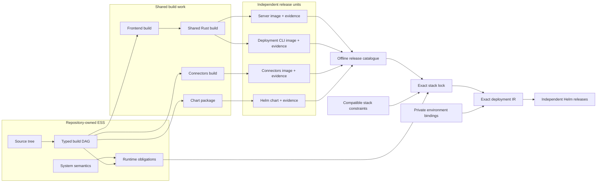

# The ESS deployment model

Devcenter is moving from a repository-specific deployment pipeline to a typed compilation model.
The important change is not a new Helm wrapper. It is that the intent, compatibility decisions,
immutable artifacts, environment obligations, and resulting rollout are separate documents with
exact identities. Each stage can therefore be reviewed and refused before anything reaches a
cluster.

## From source to rollout

The left side is stable, reviewable intent. CI performs the build in the middle and publishes
immutable release evidence. Resolution and environment compilation on the right decide what may be
deployed; only the authorized reconciler performs the final rollout.

## Systems own their truth

Each component repository describes the system it implements: its semantic operations and
outcomes, its build graph, and the runtime obligations its process exposes. A build graph names
source, pinned toolchain images, executable steps, secret mounts, caches, and release outputs. The
same graph can produce several independent outputs without rebuilding their shared prerequisites.

This keeps ownership local. Identity describes Identity, Connectors describes Connectors, and
Devcenter describes its browser application and backend. A product repository does not copy their
Dockerfiles or reinterpret their requirements. It composes released system descriptions through
their declared seams.

## Releases become evidence, not guesses

The build executor turns a declared output into an immutable release manifest. That manifest binds
one source revision to the exact semantic, build, and runtime digests; immutable image or chart
digests; supported platforms; and required provenance, SBOM, signature, and conformance evidence.
ESS validates those bindings, but deliberately does not build, publish, or deploy anything. CI and
the authorized release service remain the effectful executors.

An image and its Helm chart are separate release units. Changing a chart no longer requires
pretending that application bytes changed, and changing one service no longer requires rebuilding
the rest of the product.

## A stack is a constraint; a lock is a decision

Devcenter's generic stack declares compatible version ranges, required semantic surfaces, rollout
dependencies, and typed external systems. An offline resolver selects only releases whose manifests
and evidence satisfy those constraints and emits an exact stack lock. The lock contains no
"latest", mutable tag, or hidden registry lookup. It is a complete, reviewable answer to *which
released things belong together?*

This separation lets a component release independently while a deployed environment remains
unchanged until its lock intentionally advances. Compatibility policy is visible in the stack;
the selected bytes are visible in the lock.

## Environments bind obligations without owning secrets

The generic stack knows that a workload needs an endpoint, configuration coordinate, secret slot,
or authority audience. It does not know deployment hostnames, credential bytes, cluster identities,
or organization policy. A private environment document satisfies those obligations with endpoint
bindings, references to existing secret objects, service accounts, and a target cluster and
namespace.

Compilation lowers the exact stack lock plus those bindings into an exact deployment IR: one Helm
release per independently deployable service and an explicit rollout dependency graph. Missing
bindings, incompatible releases, mutable artifacts, undeclared secrets, and insufficient authority
are compilation refusals rather than late runtime surprises. The authorized reconciler can then
apply that IR through the target cluster's existing Kubernetes and RBAC boundary.

## Why this changes the release loop

The model replaces a full-stack rebuild with a dependency-aware sequence:

1. A component change rebuilds only the affected release outputs and shared build nodes.
2. The executor publishes immutable artifacts and their evidence.
3. The stack resolver proposes a new exact lock only when compatibility constraints admit it.
4. The environment compiler proves that every runtime obligation still has a binding.
5. The reconciler updates independent Helm releases in dependency order and verifies the result.

The result is both faster and stricter: routine component releases become small, while the complete
product remains reproducible from typed source through immutable artifacts to cluster rollout.

Devcenter currently commits its semantic system and canonical multi-output build graph together
with deterministic BuildKit projections. The runtime-manifest, stack-lock, and private-environment
stages are the next adoption boundary; until they are active, the existing deployment path remains
the operational authority.
